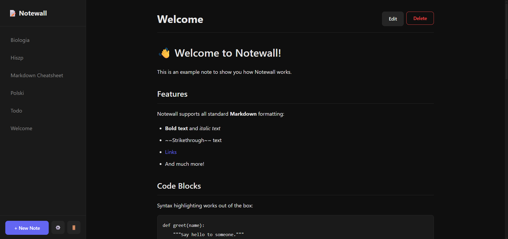
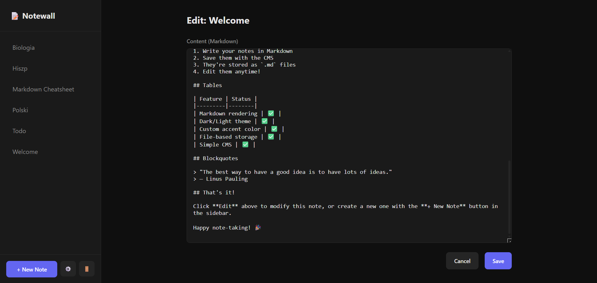
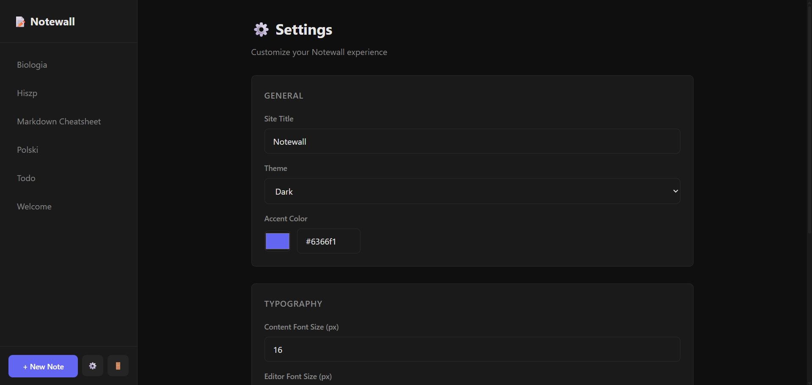

# 📝 Notewall

A lightweight, file-based Markdown notes app with a simple CMS. Built with Python/Flask.


## ✨ Features

- **File-based storage** — Notes are plain `.md` files, no database needed
- **Markdown rendering** — Full support with syntax highlighting
- **Simple CMS** — Create, edit, and delete notes from the browser
- **Dark/Light themes** — Easy on the eyes (not lightmode, tfu, I struggle not to delete it)
- **Customizable** — Accent color, font sizes, editor height
- **Lightweight** — Just Python + Flask, minimal dependencies
- **Portable** — Run anywhere with Python installed

## 📸 Screenshots

### Formated file Preview

## 

### Editing file Preview

## 

### Settings Preview

##

## 🚀 Quick Start

```bash
# Just clone the repo
git clone https://github.com/yourusername/notewall.git
cd notewall

# Create virtual environment (optional)
python -m venv .venv
source .venv/Scripts/activate   # Or on Linux: .venv/bin/activate

# Install dependencies (only 3)
pip install -r requirements.txt

# Create .env file and write inside:
NOTEWALL_PASSWORD=yourpassword
SECRET_KEY=somerandomstring

# just run the file and server starts
python app.py
```

Opens on http://localhost:5000

You can also delete images, they're just for this preview up there.

#### ! - Beware, it might differ based on your OS. - !

## 📁 Project Structure

```
Notewall/
├── app.py              # Main Flask application
├── requirements.txt    # Python dependencies
├── settings.json       # User settings (auto-generated)
├── notes/              # Your markdown files go here
│   ├── welcome.md
│   └── ...
├── static/
│   └── style.css       # Styling
└── templates/          # HTML templates
    ├── base.html
    ├── home.html
    ├── note.html
    ├── editor.html
    ├── settings.html
    └── 404.html
```

## ⚙️ Settings

Click the ⚙️ gear icon in the sidebar to customize:

- **Site Title** — Name shown in the header
- **Theme** — Dark or Light mode
- **Accent Color** — Customize buttons and links
- **Font Sizes** — Content and editor font sizes
- **Editor Height** — How tall the editor textarea is

Settings are saved to `settings.json`.

## 📄 License

MIT License — feel free to use this however you want, I own this as much as you do.

# Some my yapping

Tbh the site strongly vibe-coded cuz i just wanted simple webapp for my notes, so don't gimme no credits. I wouldn't mind seeing your implementation tho.

I've made it in mind to host on my raspi so it's simplest as I can. Again, feel free to do whatever you want with it, I do appreciate any feedback tho.

---

MKazm

<small>(Im really not a vibe-coder i swear)</small>
